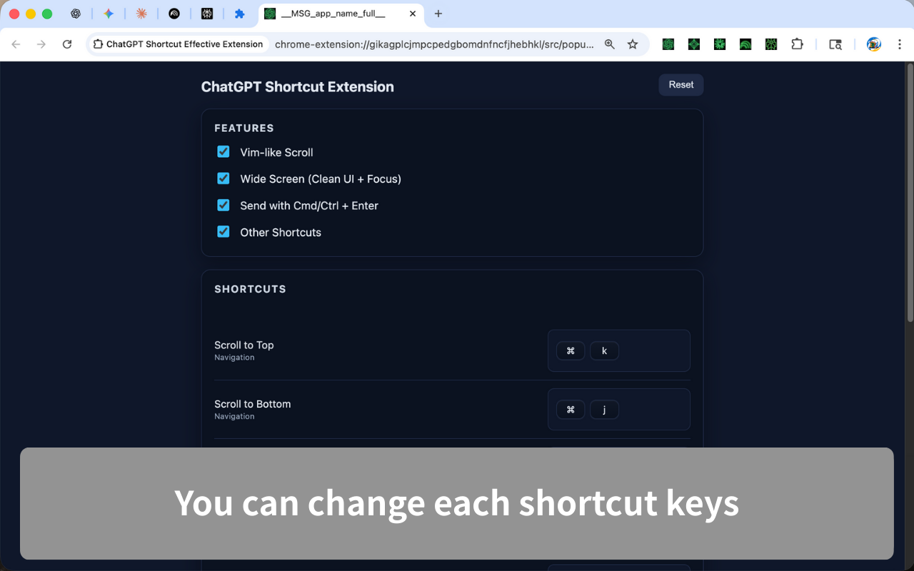

# ChatGPT Shortcut Effective Extension

[](./LICENSE)

<!-- Add other badges here if desired (CI Status / Version, etc.) -->

- Chrome Web Store: [ChatGPT Shortcut Effective Extension](https://chromewebstore.google.com/detail/chatgpt-shortcut-effectiv/aoemceeicbdlapmljecabaegdjnifllg?authuser=0&hl=en)

## Overview

A Chrome extension that makes ChatGPT easier to use with a keyboard-centric workflow. It provides safe send (Cmd/Ctrl+Enter), Vim-like scrolling, model-switching shortcuts, quick access to Temporary Chat, and UI cleanup—all in one package. You can toggle each feature on/off and customize shortcuts directly from the popup.

This is an open-source extension implemented based on Chrome Extension Manifest v3.

---

## Features

- **Vim-like scrolling**: Customizable `j`/`k` navigation, half-page jumps, and more
- **Wide Screen + Focus toggle**: Cleaner, wider layout while preserving input field focus
- **Safe send**: Prevents accidental Enter-only sends; requires Cmd/Ctrl+Enter to submit
- **Model operation shortcuts**: Quickly open the model selector or switch directly to Auto/Instant/Thinking modes
- **Extra utilities**: Launch Temporary Chat, view shortcut help overlay, and more

<!-- For a simple extension, 2-5 items are fine -->

---

## Screenshots

Screenshots will be added later (see `docs/images/README.md`). Currently showing local captures as placeholders.

| Screen                                          | 
| ----------------------------------------------- | 
|  | 
|  | 

---

## Installation

### Chrome Web Store

- Install directly from the Chrome Web Store: [ChatGPT Shortcut Effective Extension](https://chromewebstore.google.com/detail/chatgpt-shortcut-effectiv/aoemceeicbdlapmljecabaegdjnifllg?authuser=0&hl=en)

### Local installation (Developer Mode)

### 1. Clone the repository

```bash
git clone https://github.com/gakkunn/Ex-Chrome-ChatGPT.git
cd Ex-Chrome-ChatGPT
```

### 2. Install dependencies & Build

```bash
npm install
npm run build   # or npm run dev (watch build to dist/ for development)
```

### 3. Install to Chrome (Developer Mode)

1. Open Chrome
2. Go to `chrome://extensions/`
3. Toggle **"Developer mode"** on in the top right corner
4. Click **"Load unpacked"**
5. Select the `dist/` directory (build output). Keep `npm run dev` running if you want auto-rebuilds.

---

## Usage

1. After installing the extension, pin the icon from the Chrome toolbar.
2. Use the popup to toggle features on/off and click any shortcut input field to rebind it with conflict detection.
3. Examples: `j`/`k` for scrolling, `Shift + Space` to toggle input focus, `Cmd/Ctrl + Enter` for safe send, `Cmd/Ctrl + Shift + 8/9/0` to switch to Auto/Thinking/Instant modes, `Cmd/Ctrl + I` to open Temporary Chat.

---

## Development

<!-- Written to be separable for projects with/without a build step -->

### Prerequisites

- Node.js: >= 18 (recommended for Vite 7)
- npm

### Setup

```bash
git clone https://github.com/gakkunn/Ex-Chrome-ChatGPT.git
cd Ex-Chrome-ChatGPT

npm install
npm run dev   # watch build to dist/
```

### Test

Automated tests are not configured yet.

---

## Project Structure

```text
Ex-Chrome-ChatGPT/
  src/                # Extension source code (background, content, popup, manifest, shared)
  dist/               # Build artifacts
  docs/images/        # Screenshots and store assets
  public/             # Icons/static files
  config/             # Tooling configs (ESLint, type declarations)
  scripts/            # Utility scripts
  vite.config.ts      # Vite configuration
  package.json        # npm scripts and dependencies
  README.md
  LICENSE
```

* Edit to match your actual structure.

---

## Contributing

Bug reports, feature suggestions, and pull requests are welcome 🎉

Please refer to [CONTRIBUTING.md](./CONTRIBUTING.md) for detailed guidelines.

Quick steps:

1. Check Issues; create a new one if it doesn't exist
2. Fork the repository
3. Create a branch (e.g., `feat/xxx`, `fix/yyy`)
4. Commit changes and push
5. Create a Pull Request

---

## Privacy Policy
This extension does not collect personally identifiable information and does not send browsing data to external servers. Settings such as feature toggles and custom shortcuts are stored locally (Chrome storage). For details, please see our [Privacy Policy](./PRIVACY_POLICY.md).

---

## License

This project is released under the [MIT License](./LICENSE).

